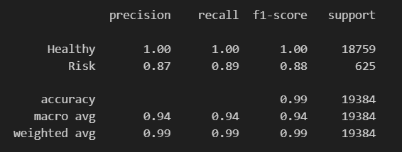
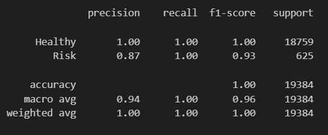

# Module 20 Report 

## Supervised Learning Overview 🤖

* The purpose of this analysis was to use different training models to evaluate loan risks based on historical lending activity. Different models were built to identify creditworthiness of borrowers.
* The historical data was used to predict whether loans were to be given "healthy" or "high risk" labels. Healthy loans were given to individuals who are more likely to make payments on time. High risk loans were given to individuals who are more likely to make late or no payments. 
* The function "value_counts" was used to calculate the number of healthy loans vs high risk loans. 
* The stages of the machine learning process that were used in this analysis are as follows:  
  1. Separate data into labels
  2. Check the balance of the labels using value_counts
  3. Split the data into training and testing datasets
  4. Create a logistic regression model 
  5. Fit the model
  6. Make predictions
  7. Analyze the predictions  

* I used a logistic regression model on the original data the a logistic regression model using random oversampled data.

## Results

## Machine Learning Model 1:
  * There were 75036 healthy loans and 2500 high risk loans using Traning and Testing sets.
  * The balanced accuracy score was 94%.
  * Precision was 1.00 for healthy loans and 0.87 for high risk loans.
  * Recall was 1.00 for healthy loans and 0.89 for high risk loans. 
 

## Machine Learning Model 2:
  * There were equal healthy and high risk loans using a random over sampler model. 
  * The balanced accuracy score was 99%.
  * Precision was 1.00 for healthy loans and 0.87 for high risk loans.
  * Recall was 1.00 for healthy loans and 1.00 for high risk loans. 
 

## Summary

* The second model using random oversampled data worked the best because it had the best accuracy,  precision, and recall scores. If you are a bank customer applying for a loan, you would want those scores as well as the f1 scores to be as close to 1 as possible so that you are as fairly judged for a loan as possible.

* The type of machine learning algorithm choosen depends on the problem you're trying to solve. For this challenge, supervised learning was used for prediction tasks. For lending purposes a person's likelihood of repaying a loan was predicted using historical payment data. 

